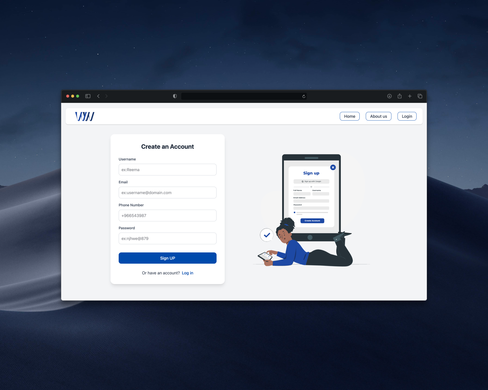
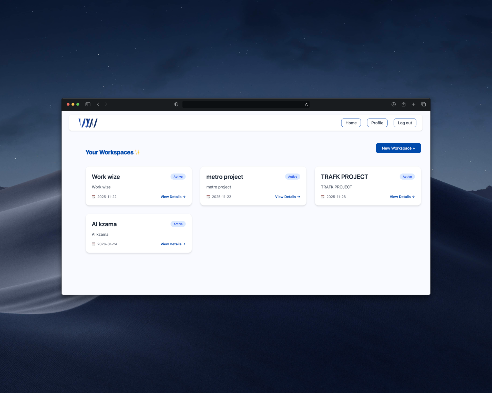
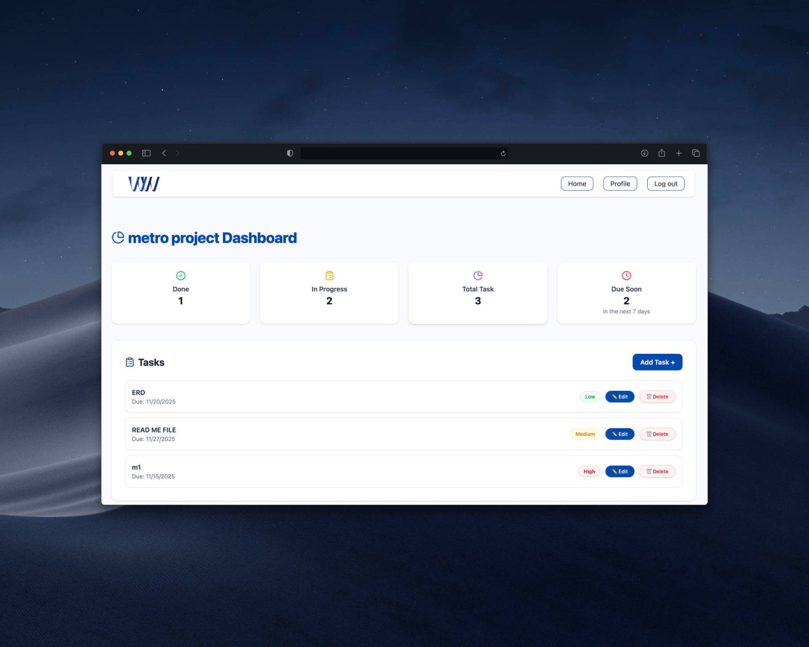

# Work Wize

______________________ 

## 📝 Description

Workwize is a fully integrated,  project that represents  the skills I've learned in the software engineering Bootcamp. It's a project and task management system designed for businesses and teams to streamline workflows efficiently. The application allows users to create workspaces, manage tasks, assign team members, and monitor progress through an interactive dashboard. The backend was developed using Python, the Django REST framework (DRF), and PostgreSQL, while the frontend was built using React and Tailwind CSS, with JWT authentication for secure access.

## 💻 Technologies Used

| Area          | Technologies |
|---------------|--------------|
| **Backend**   | Python, Django REST Framework (DRF), PostgreSQL |
| **Frontend**  | React, Tailwind CSS |
| **Dev Tools** | Git, GitHub, Postman |

## 🔗 Back End Repository

You can find the Backend source code here:  
👉 [Backend Repository](https://github.com/AbrarAlabbad77/workWize_backend)
👉 [Frontend Repository](https://github.com/AbrarAlabbad77/workWize_frontend)

---

## ✅ Planning

### 📌 Entity Relationship Diagram (ERD)

# RESTful Routing 
## Routing Table (Server/Backend) 
---Projects---
| Method | Endpoint            | Description             |
| ------ | -----------------   | ------------------------|
| GET    | `/api/projects`     | Get all projects        |
| POST   | `/api/projects`     | Create a new project.   |
| GET    | `/api/projects/:id` | Get specific project    |
| PUT    | `/api/projects/:id` | Update aspecific project|
| DELETE | `/api/projects/:id` | Delete aspecific project|

---Task---
| Method | Endpoint                         | Description                   | 
| ------ | ------------------------------   | ----------------------------- | 
| GET    | `/api/projects/:projectId/tasks` | Get all tasks for a project   | 
| POST   | `/api/projects/:projectId/tasks` | Create a task under a project | 
| GET    | `/api/tasks/:id`                 | Get specific task             | 
| PUT    | `/api/tasks/:id`                 | Update specific task          | 
| DELETE | `/api/tasks/:id`                 | Delete specific task          | 

---Team Member---
| Method | Endpoint                     | Description                    | 
| ------ | --------------------------   | ------------------------------ | 
| GET    | `/api/tasks/:taskId/members` | Get members assigned to a task | 
| POST   | `/api/tasks/:taskId/members` | Add a member to a task         | 
| PUT    | `/api/members/:id`           | Update member details          | 
| DELETE | `/api/members/:id`           | Remove a member                |

---Manager---
| Method | Endpoint            | Description             | CRUD   |
| ------ | ------------------- | ----------------------- | ------ |
| GET    | `/api/managers`     | Get all managers        | Read   |
| POST   | `/api/managers`     | Create a new manager    | Create |
| GET    | `/api/managers/:id` | Get specific manager    | Read   |
| PUT    | `/api/managers/:id` | Update specific manager | Update |
| DELETE | `/api/managers/:id` | Delete specific manager | Delete |

## Routing Table (Client/Frontend)
| **Path**                      | **Component**     | **Description**                                 |
| ----------------------------- | ----------------- | ----------------------------------------------- |
| `/landhome`                   | `<LandPage />`    | Landing page introducing the platform           |
| `/aboutUs`                    | `<AboutUs />`     | About page with company or team information     |
| `/signup`                     | `<Signup1 />`     | User registration page                          |
| `/login`                      | `<Login />`       | User login page                                 |
| `/newspace`                   | `<NewProject />`  | Create a new workspace or project               |
| `/home`                       | `<Home />`        | Main dashboard or home page after login         |
| `/spaces/:project_id`         | `<SpaceDetail />` | View details of a specific workspace or project |
| `/spaces/:project_id/newtask` | `<NewTask />`     | Create a new task inside a specific workspace   |

## 🖼️ Screenshots
Landing Page:  

Sigu up Page:  

Home Page:  

Project Dashboard:  

## ✅ Features 
- Create and manage workspaces/projects
- Assign tasks to team members
- Track task status and progress
- Interactive dashboard with task overview
- Secure authentication using JWT
- Responsive UI built with React and Tailwind CSS

## 🚀 Future Improvements

1. Implement a comments model for tasks.  
2. Allow users to add comments on specific tasks.  
3. Enhance the dashboard with additional functionality.  
4. Add a graph to the dashboard showing high-priority tasks.  
5. Add a graph to the dashboard highlighting tasks nearing their due date.  
6. Implement a team model for better group management.  
7. Allow grouping of users into teams.  
8. Add user profile management features.  
9. Include an “About Me” page for user information.  
10. Implement a notification system for updates and reminders.  
11. Integrate a calendar feature to track tasks and deadlines.

## 📫 Contact

- 💼 LinkedIn: [Abrar Alabbad](https://www.linkedin.com/in/abrar-alabbad-948b83279/)
- 🎨 Behance: [Abrar Alabbad](https://www.behance.net/abraralabbad)
- 🔗 Portfolio: [Abrar Portfolio](https://abraralabbad77.github.io/Portfolio/)
- 📧 Email: AbrarAlabbad192@outlook.com
